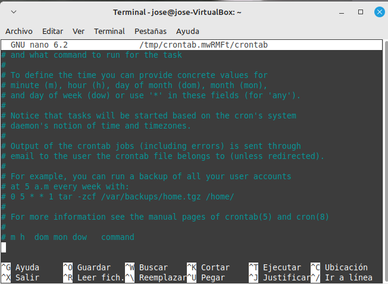
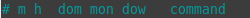

# Tareas Programadas

## Linux

### Tareas por tiempo (puntuales)

En Linux no suelen venir instaladas aplicaciones para esto, por ello el paquete más importante de estos es el llamada "at". Normalmente at suele ser invocado con varias formas:
 
- Formato (horas): 12H AM/PM o también formatos especificos como `noon (12:00)`, `midnight (0:00)`, etc.
- Formato (fecha): La más comun, la japonesa, hecha de ña siguiente manera: `YY-MM-DD`, aunque hay más formatos
- Formato (lenguaje natural): Esto solo funcioan en inglés `next month (siguiente mes)`, `now + 10 min (desde ahora + 10 minutos)`, `next week - 2 days (la próxima semana - 2 días)`

Una vez que se ha invocado el at, se nos abre una pequeña terminal, en la cual podemos jugar con at. Podemos salir de el simplemente pulsando `CTRL + D`. Vease en este ejemplo

```
at 18:00 tomorrow

at> who  >> ~/usuarios.txt 2>> ~/usuarios.err
at> last >> ~/usuarios.txt 2>> ~/usuarios.err

Ctrl+D
```

También existe la posibilidad de escribir una tarea en una sola linea, sin el interprete, pero hay que tener cuidado con usar bien los comandos. Hay varias opciones para crear una tarea en una sola línea:

- <<< + " "

En el siguiente caso se utiliza para almacenar la dirección 

```
at now + 10min <<< "uptime > ~/carga.txt 2> carga.err"
```

- echo + |

```
echo "uptime > ~/carga.txt 2> carga.err" | at now + 10min
```

- En el caso de querer usar scripts, lo hacemos con -f

```
at next month + 1 day -f ~/scripts/copia_seguridad.sh >> ~/backup.txt 2>> ~/backup.err
```


Otras opciones utiles con at son:

- `atq` o `at -l`: Lista todas tareas programadas
- `at -c (id de la tarea)`: Mostrar los detalles de la tarea con ID especificado
- `atrm X (id de la tarea)`: Borra la tarea especificada

Podremos descubir más de at con el comando `man at`


### Tareas por tiempo (repetitivas)

En este caso, usaremos el programa crontab. Este es un poco más extenso que at, y se utiliza de la siguien manera: debemos colocar `crontab -e`. Esto nos abre un pequeño editor de texto (como Vi o Nano). Dentro de el tendremos un menú como este:



Al final del documento podemos observar una siglas. Estos seran los datos que debemos indicarle a crontab para que ejecute el comando cuando queramos: 



- `m`: minutos (de 0 a 59)
- `h`: horas (de 0 a 23)
- `dom`: día del mes (del 1 al 31, dependiendo del mes)
- `mon`: mes (de 1 a 12)
- `dow`: día de la semana (0: domingo, 1: lunes, 2: martes, 3: miercoles, 4: jueves, 5: viernes, 6: sábado) 
- `command`: comando o script a ejecutar

Dentro de estos parametros, entraran unos valores los cuales pueden ser indicados de las siguientes formas:

- `*`: cualquier valor 
- Rangos `(-)`: 


